# Лабораторная работа 7

### Анализ и преобразование кода с использованием Clang и LLVM

### Цель лабораторной работы

>Познакомиться с инструментарием Clang и LLVM, освоить получение абстрактного синтаксического дерева (AST) и промежуточного представления (LLVM IR) для кода на C/C++, научиться применять базовые оптимизации, строить графы потока управления (CFG), а также анализировать влияние оптимизаций на различные синтаксические конструкции языка.


_Автор:_ Комиссарова Юлия\
_Группа:_ АП-326\
_Дисциплина:_ Теория формальных языков и компиляторов\
_Год:_ 2026


### Постановка задачи:
- Установить Clang и LLVM;
- Скомпилировать простой C-файл с использованием clang и получить его: абстрактное синтаксическое дерево (AST), промежуточное представление LLVM IR;
- Использовать opt для применения базовой комплексной оптимизации (например, О2);
- Построить граф потока управления (CFG) для оптимизированной программы;
- Проанализировать результат, сделать выводы и ответить на контрольные вопросы.
- Выполнить индивидуальное задание в соответствии со своим оператором из КР / РГР.


## 1. Общая часть работы

### __1.1 Установка среды__
Установка Clang, LLVM, opt и Graphviz:
>sudo apt install clang llvm
>sudo apt install graphviz

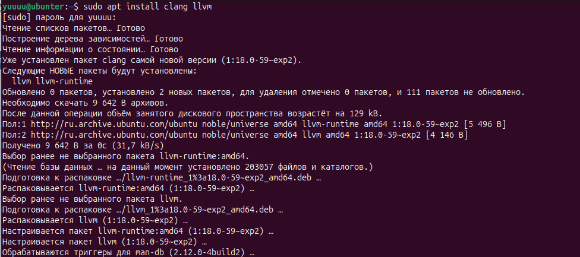\
Рис. 1 – Установка Clang и LLVM

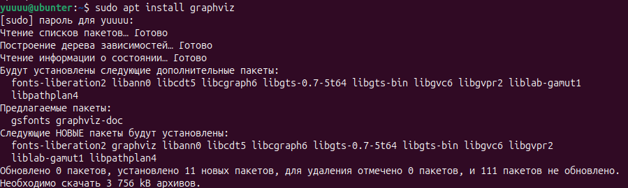\
Рис. 2 – Установка Graphviz

### __1.2 Исходный код__

Был создан исходный файл main.c, содержащий программу с функцией square и функцией main
```#include <stdio.h>
int square(int x) {
    return x * x;
}
int main() {
    int a = 5;
    int b = square(a);
    printf("%d\n", b);
    return 0;
}
```

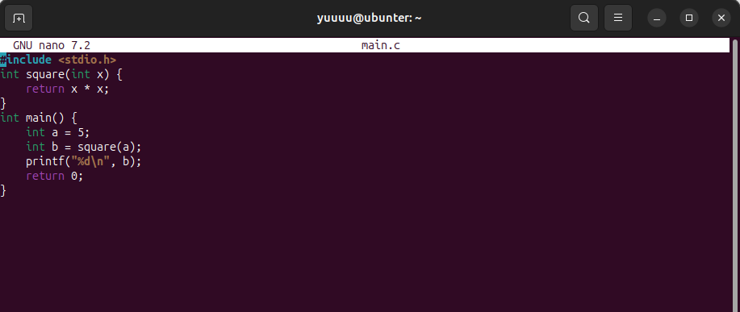\
Рис. 3 – Исходный код программы main.c


### __1.3 Работа с AST__

С помощью команды clang -Xclang -ast-dump -fsyntax-only main.c было получено абстрактное синтаксическое дерево (AST)

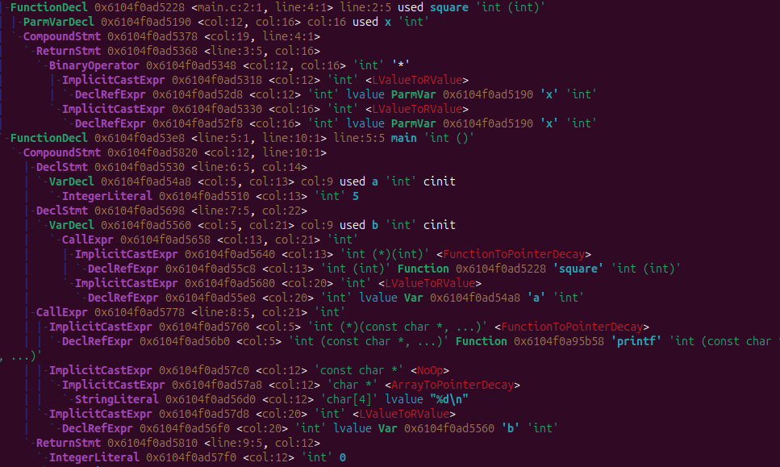\
Рис. 4 – Абстрактное синтаксическое дерево (AST) программы main.c

### __1.4 Генерация LLVM IR__
Было получено промежуточное представление LLVM IR с помощью команды
>clang -S -emit-llvm main.c -o main.ll

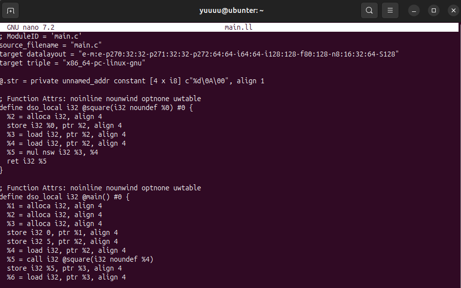\
Рис. 5 – main.ll

### __1.5 Оптимизация IR__
Примение оптимизации с помощью opt и/или флагов Clang

Был получен LLVM IR без оптимизаций с использованием флага -O0
>clang -O0 -S -emit-llvm main.c -o main_O0.ll

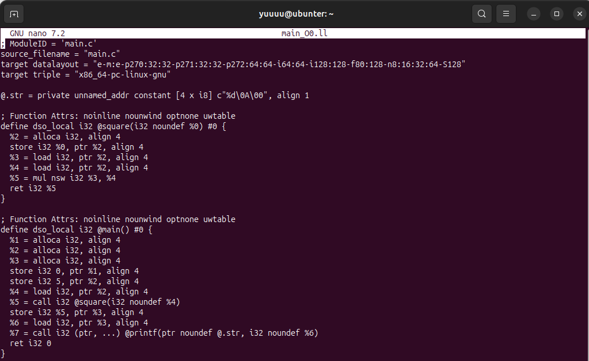\
Рис. 6 – main_O0.ll

Далее была применена оптимизация -O2
>clang -O2 -S -emit-llvm main.c -o main_O2.ll

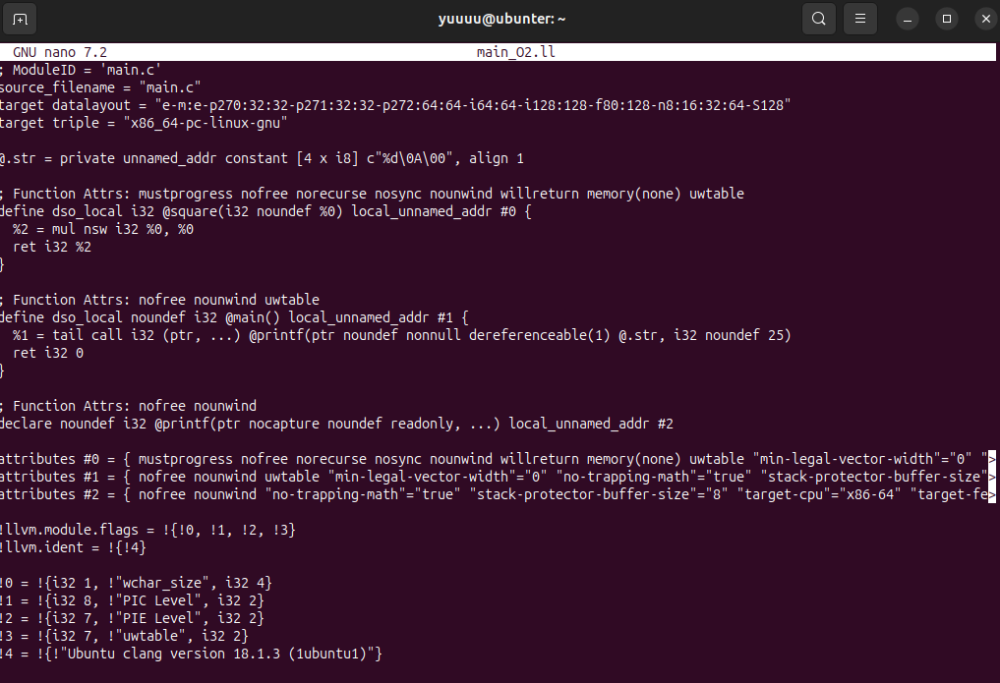\
Рис. 7 – main_O2.ll

Сравнение двух файлов:
>diff main_O0.ll main_O2.ll

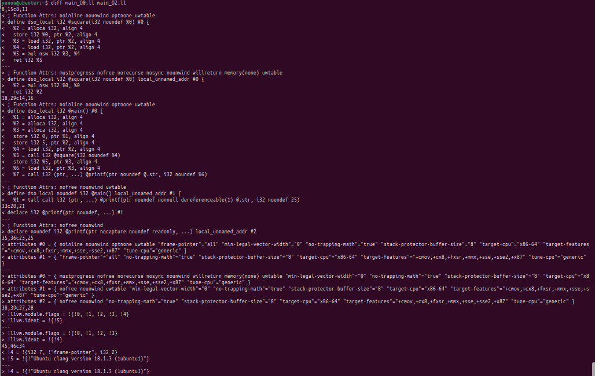\
Рис. 8 – Сравнение LLVM IR до (-O0) и после (-O2) оптимизации


### __1.6 Построение CFG__

С помощью инструмента opt был построен граф потока управления (CFG).

\
Рис. 9 – Генерация DOT-файлов CFG для функций main и square после оптимизации -O2

Командой find . -name "*dot" найдены файлы .main.dot и .square.dot, сгенерированные ранее утилитой opt.

\
Рис. 10 – DOT-файлы для построения CFG функций

Полученные .dot файлы были преобразованы в изображения с помощью Graphviz.

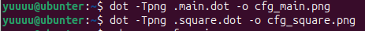\
Рис. 11 – Генерация PNG-изображений графов из DOT-файлов.

Командами xdg-open cfg_main.png и xdg-open cfg_square.png открыты изображения графов для функций main и square.

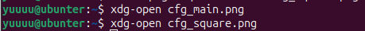\
Рис. 12 – Открытие PNG-файлов CFG


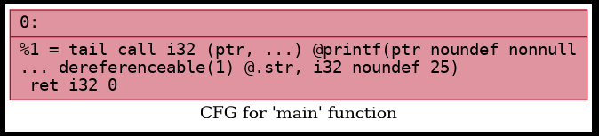\
Рис. 13 – CFG функции main

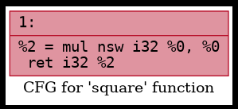\
Рис. 14 – CFG функции square

### __1.7 Выводы__
- С помощью Clang можно получить полную структуру AST и IR, а также CGF;
- LLVM предоставляет гибкие инструменты анализа и оптимизации;
- Промежуточное представление кода удобно для написания компиляторных трансформаций.


## Индивидуальное задание

### __2.1 Создание файла__

Командой nano array.cpp создан и открыт файл с исходным кодом программы

\
Рис. 15 – Создание файла array.cpp

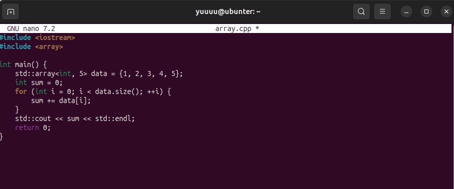\
Рис. 16 – Исходный код программы array.cpp


### __2.2 Получение IR (-O0 и -O2)__

Без оптимизации (-O0):

>clang++ -O0 -S -emit-llvm array.cpp -o array_O0.ll

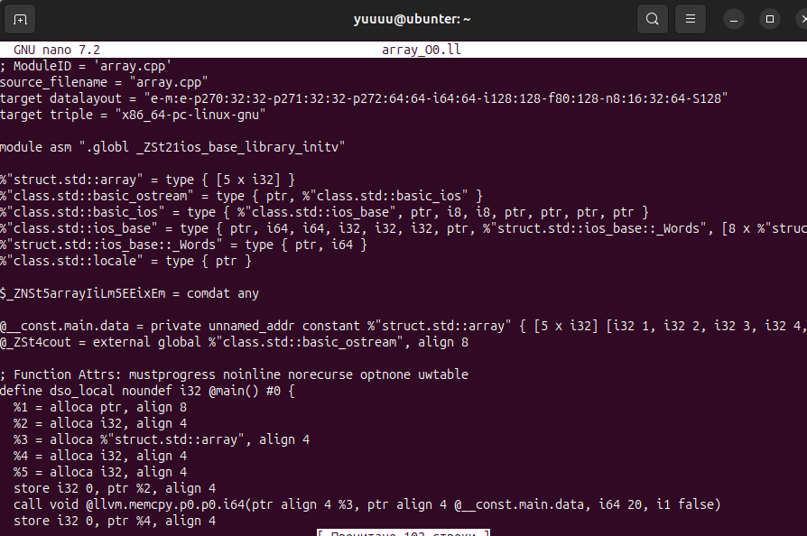\
Рис. 17 – array_O0.ll

С оптимизацией (-O2):

>clang++ -O2 -S -emit-llvm array.cpp -o array_O2.ll

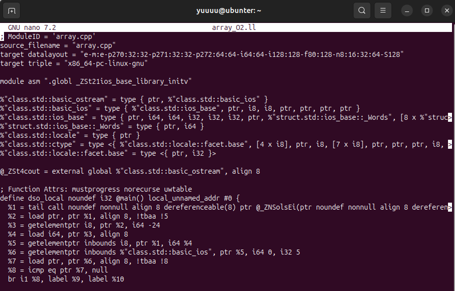\
Рис. 18 – array_O2.ll

### __2.3 Исследование развёртывания цикла__

Выполнена генерация LLVM IR с оптимизацией -O2 и дополнительным флагом -funroll-loops, который разворачивает циклы. Команда diff array_O2.ll array_unroll.ll показывает различия между обычной оптимизацией -O2 и версией с разворотом циклов.

>clang++ -O2 -funroll-loops -S -emit-llvm array.cpp -o array_unroll.ll
>diff array_O2.ll array_unroll.ll

\
Рис. 19 – Сравнение LLVM IR с -O2 и -O2 -funroll-loops

_Сравнение IR с -O2 и -funroll-loops показало, что изменений нет. Это означает, что цикл не разворачивается, так как он был полностью удалён компилятором после оптимизации (сумма вычислена заранее)._

### __2.4 Построение CFG__

>clang++ -O0 -S -emit-llvm array.cpp -o array_O0.ll\
>opt -passes="dot-cfg" array_O0.ll -disable-output\
>dot -Tpng .main.dot -o cfg.png\
>xdg-open cfg.png\

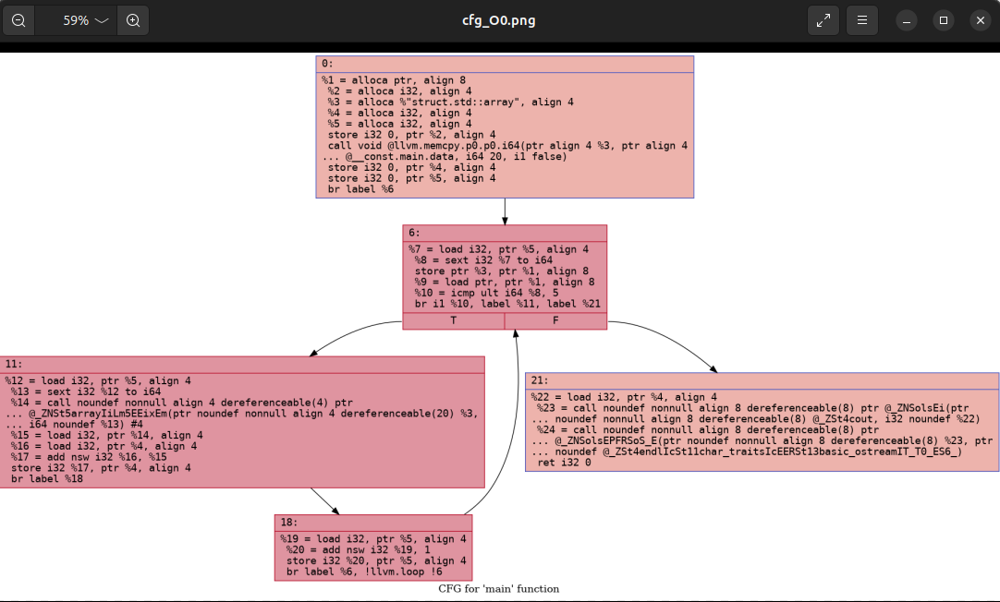\
Рис. 20 – CFG функции main для array.cpp без оптимизаций (-O0)


>clang++ -O2 -S -emit-llvm array.cpp -o array_O2.ll\
>opt -passes="dot-cfg" array_O2.ll -disable-output\
>dot -Tpng .main.dot -o cfg_O2.png\
>xdg-open cfg_O2.png\

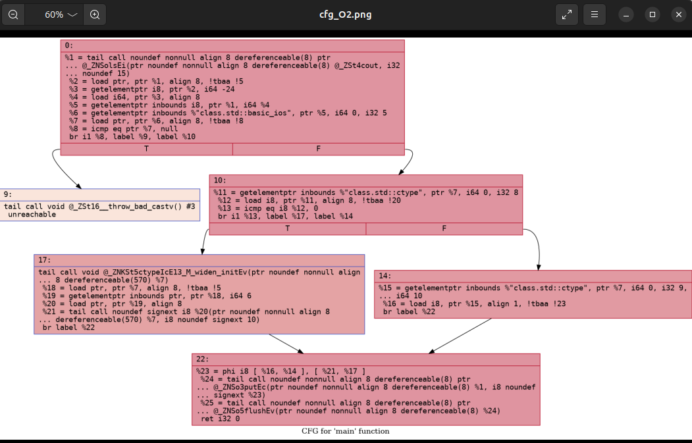\
Рис. 21 – CFG функции main для array.cpp после оптимизации -O2


### __2.5 Применение -loop-rotate и -licm_

Генерация IR без оптимизации:
>clang++ -O0 -S -emit-llvm array.cpp -o base.ll

Применение оптимизаций через opt:
>opt -passes="loop-rotate,licm" base.ll -S -o opt_loops.ll

Открыть:
>nano opt_loops.ll

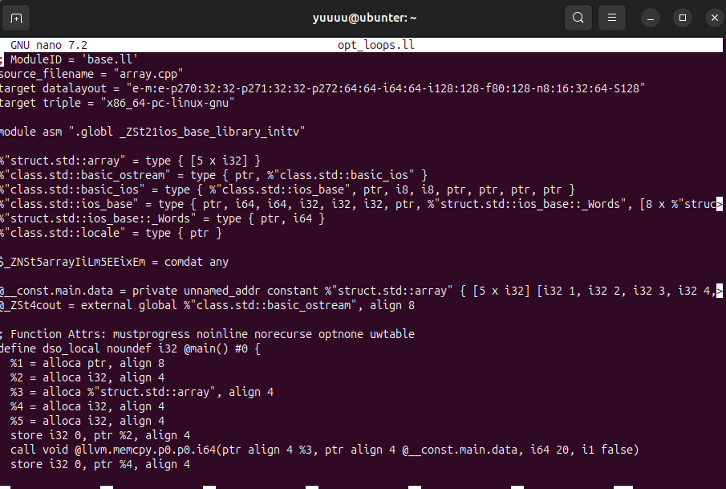\
Рис. 22 – opt_loops.ll

### __2.6 Вывод: какие оптимизации применились к массиву и циклу?__
В ходе анализа было установлено, что компилятор LLVM применяет ряд оптимизаций к работе с массивом и циклом.
- При уровне оптимизации -O2 была выполнена свёртка констант: значения массива известны на этапе компиляции, поэтому сумма элементов была вычислена заранее.
- В результате цикл был полностью устранён, так как его выполнение стало избыточным.
- Также были удалены лишние переменные и операции работы с памятью (alloca, load, store).
- Дополнительные оптимизации, такие как -licm, выносят неизменяемые вычисления за пределы цикла, а -loop-rotate изменяет структуру цикла.
- Таким образом, LLVM эффективно оптимизирует массивы и циклы, вплоть до полного удаления цикла при известном результате.


## Контрольные вопросы:
__1. Что такое Clang, и какова его роль в процессе компиляции программ?__

>Clang — это фронтенд компилятора для языков C/C++, который выполняет разбор кода и генерацию промежуточного представления.

__2. Что представляет собой LLVM и как он используется в современных компиляторах__

>LLVM — это инфраструктура компилятора, предназначенная для оптимизации и генерации машинного кода.

__3. Чем отличается абстрактное синтаксическое дерево (AST) от промежуточного представления LLVM IR?__

>AST отражает синтаксическую структуру программы, а LLVM IR — низкоуровневое представление для оптимизации.

__4. Для чего необходимо промежуточное представление (IR) в процессе компиляции__?

>IR используется для анализа и оптимизации программы перед генерацией машинного кода.

__5. Что делает инструкция alloc в LLVM IR, и зачем она используется в функциях?__

>alloca выделяет память под переменные в стеке функции. Используется для хранения локальных переменных.

__6. Зачем нужна оптимизация кода в компиляторе, и какие основные цели она преследует?__

>Оптимизация нужна для повышения скорости выполнения программы, уменьшения объёма кода, устранения лишних операций.

__7. Что такое SSA-форма и почему она важна при оптимизации программ?__

>SSA (Static Single Assignment) — это форма представления, где каждая переменная присваивается только один раз.

__8. Что такое граф потока управления (CFG) и как он помогает анализировать поведение программы?__

>CFG (граф потока управления) — это граф, показывающий переходы между блоками программы. Он помогает анализировать выполнение программы и оптимизировать её.

__9. Как устроено представление арифметических операций в LLVM IR (например, умножение, сложение)?__

>В LLVM IR арифметические операции представлены в виде отдельных инструкций трёхадресного кода, где результат каждой операции записывается в новую переменную. Например, сложение и умножение задаются инструкциями add и mul, при этом операнды и результат явно указаны: "%res = mul i32 %a, %b". Все операции выполняются над типизированными значениями (например, i32, double) и соответствуют SSA-форме, где каждая переменная присваивается только один раз.

__10. Почему функции в LLVM IR обычно представляют собой отдельные единицы анализа и оптимизации?__

>Каждая функция имеет свою область видимости и может анализироваться и оптимизироваться независимо от других.

__11. Что происходит с функцией в LLVM IR, если она вызывается один раз и очень короткая?__

>Такая функция может быть встроена прямо в место вызова, после чего может быть удалена.

__12. Какие преимущества даёт использование IR и CFG для автоматических оптимизаций по сравнению с анализом исходного текста на C?__

>Они позволяют:
>- выполнять автоматические оптимизации;
>- упростить анализ программы;
>- работать с кодом независимо от языка;
>- улучшить эффективность по сравнению с анализом исходного текста.

